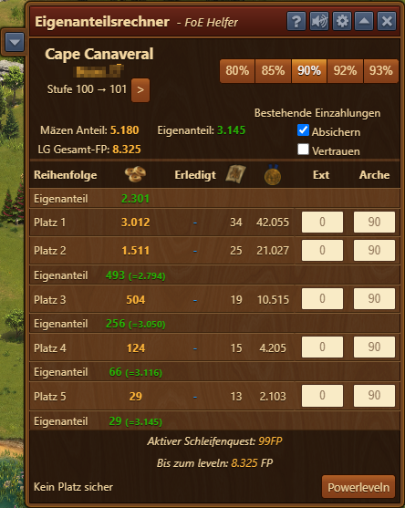
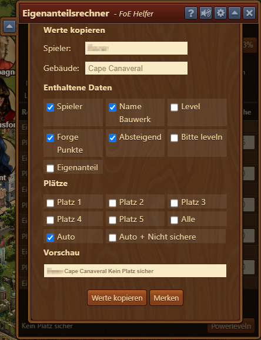
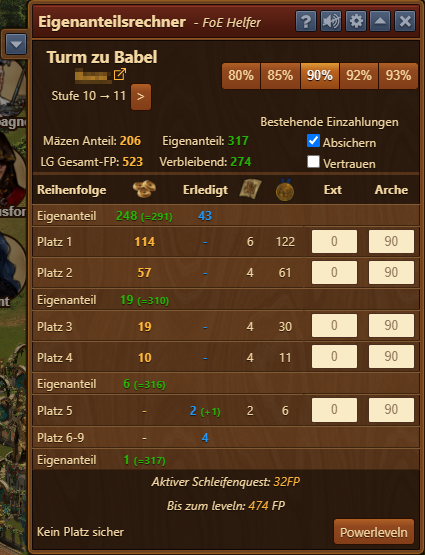
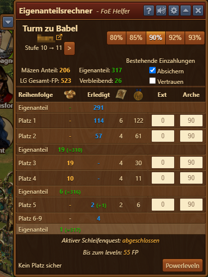

# Eigenanteilsrechner

 

Dieses Tool hilft dir dabei, dein Legendäres Gebäude mit einer 1,9-Förderkette (oder jeden anderen Wert) zu leveln.  Es rechnet aus, was du an Eigenanteil investieren musst, um Mäzenplätze abzusichern, kann die einzuzahlenden Werte in die Zwischenablage kopieren, damit sie anschließend in ein Chat hinzugefügt werden kann und prüft, ob Mäzen auch richtig eingezahlt haben.

## Aufbau

Der Eigenanteilsrechner ist wie folgt von oben nach unten strukturiert:

* Name des Bauwerks
* Besitzer inkl. Link zur Seite des Spielers auf https://foe.scoredb.io/
* Angabe der aktuellen Stufe sowie die nächste Stufe.  Mit dem Pfeil daneben kann man die Stufe ändern, um die Werte von späteren Stufen auszurechnen.
* Buttons zum Umschalten der Prozente für die Förderung
* **Mäzen Anteil:** wie viele FPs Mäzen insgesamt einzahlen
* **Eigenanteil:** wie viel FPs du insgesamt einzahlen musst
* **LG Gesamt-FP:** die Summe des Mäzen- und Eigenanteils
* **Bestehende Einzahlungen**
  * **Absichern** - Falls schon Einzahlungen von anderen Spielern vorhanden sind, werden diese Spieler sobald möglich auf dem zur Einzahlung passenden Platz abgesichert. Dies ist die Voreinstellung.
  * **Vertrauen** - Falls schon Einzahlungen von anderen Spielern vorhanden sind, wird darauf vertraut dass diese Spieler weder einander noch neu einsteigende Investoren überholen (d.h. die vorhandenen und kommenden Einzahlungen werden ausschließlich gegen neu Investierende abgesichert). Diese Option ist in der Voreinstellung nicht aktiv und sollte mit Bedacht verwendet werden.
* Tabelle:
  * **Reihenfolge** - gibt an, wer in welcher Reihenfolge einzahlen muss.  Im o.g. Beispiel muss der LG-Besitzer mit einer Eigenleistung von 2301 FP anfangen, um die Mäzenplätze 1 und 2 abzusichern.
  * Die Anzahl der FP, die eingezahlt werden müssen
  * **Erledigt** - wie viele FP bereits eingezahlt wurden
  * Die Anzahl der Blaupausen, die der Mäzen mit dem angegebenen Archenbonus bekommt
  * Die Anzahl der Medaillen, die der Mäzen mit dem angegebenen Archenbonus bekommt
  * **Ext** - hier werden externe, bereits belegte Plätze erkannt und auf die richtige Stelle einsortiert
  * **Arche** - die Mäzenboni (%) der jeweiligen Plätze.  Diese können individuell angepasst werden.
* **Aktiver Schleifenquest:** zeigt an, ob ein wiederkehrender Quest abgeschlossen ist
* **Bis zum leveln:** die Anzahl der FPs, die noch benötigt werden, um das Bauwerk zu leveln.
* **Powerleveln** - öffnet das Powerleveln-Dialog, was unten beschrieben ist.

## Konfiguration

Hier können die Buttons konfiguriert werden, die oben rechts im Hauptdialog angezeigt werden.

**Kopieren - Format pro legendärem Bauwerk speichern** - Wenn aktiviert, dann werden die allgemeinen Informationen die zum Kopieren zusammengestellt werden für jedes Bauwerk individuell gespeichert (siehe "Enthaltene Daten" im Abschnitt zur Kopierfunktion). Diese Option ist nicht voreingestellt.

## Kopierfunktion

### Einfaches Leveln

Wenn man auf die Pfeiltaste links von der Titelleiste klickt, öffnet sich der Dialog, um einzelne Plätze des aktuellen Levels auszuschreiben.  Dieser baut sich folgendermaßen auf:

* **Spieler** - der Name des Spielers.  Diesen kannst du überschreiben, falls du deinen Namen im Chat beispielsweise kürzen möchtest.
* **Gebäude** - der Name des LGs.  Dieser kann ebenfalls überschrieben werden.  In diesem Beispiel könnte man das Ganze auf "Cape" abkürzen, zum Beispiel
* **Enthaltene Daten** - hier gibt man an, welche Informationen in der zu kopierenden Zeile angegeben werden sollen:
  * **Spieler** - Name des Spielers
  * **Name Bauwerk** - Name des LGs
  * **Level** - Angabe des aktuellen und des angestrebten Levels
  * **Forge Punkte** - Anzahl der FPs, die jeder Mäzen einzahlen soll
  * **Absteigend** - ob die Mäzenplätze absteigend (P5 → P1) angegeben werden sollen oder umgekehrt
  * **Bitte leveln** - ob "Bitte leveln" dazugeschrieben werden soll oder nicht
  * **Eigenanteil** - Anzahl der FPs, die du selber einzahlen musst
* **Plätze** - gibt an, welche Mäzenplätze ausgeschrieben werden sollen:
  * **Platz 1** bis **Platz 5** - hier kann man Haken setzen, wenn gewisse Mäzenplätze explizit ausgeschrieben werden sollen, unabhängig von folgenden automatischen Kalkulationen.
  * **Alle** - setzt alle Haken neben **Platz 1** bis **Platz 5**
  * **Auto** - setzt die Haken nur neben den Mäzenplätzen, die abgesichert sind.
  * **Auto + Nicht sichere** - (hier brauche ich Hilfe.  Was ist der Unterschied to "Alle"?)
* **Vorschau** - hier sieht man eine Vorschau des generierten Textes
* **Werte kopieren** - kopiert den generierten Text in die Zwischenablage, damit sie anschließend in ein Chat eingefügt werden kann.
* **Merken** - hiermit kannst du die generierten Texte verschiedener LGs in der Zwischenablage sammeln, um sie dann auf einmal in ein Chat einzufügen.

### Powerleveln

Drückt man auf **Powerleveln**  im Hauptdialog, öffnet sich dieses Fenster, wo die benötigten FPs der nächsten Level angezeigt und kopiert werden können.  Der Dialog baut sich folgendermaßen auf:

* Name des LGs
* **Max. Level** - das maximale Level, was in der Liste angezeigt werden soll
* **Summe Eigenanteil** - wie viel man selber investieren muss, um **Max. Level** zu erreichen.
* Die Tabelle besteht aus folgenden Spalten:
  * **Level** - von-bis-Angabe des Levels
  * **Platz1** bis **Platz5** - die FPs, die die Mäzen einzahlen müssen.  Es zählen dabei die Prozentsätze, die man im Hauptdialog angegeben hat.
  * **Eigenanteil Brutto** - den Eigenanteil, den man normal einzahlen muss
  * **Doppelernte** - die Anzahl der FPs, die man beim Leveln herausbekommt
  * **Eigenanteil Netto** - **Eigenanteil Brutto** abzüglich **Doppelernte**
  * **Kopieren** - wie beim [Einfachen Leveln ](#einfaches-leveln) werden die generierten Texte der aktuellen Zeile in die Zwischenablage gelegt, damit sie in ein Chat eingefügt werden können.  Es wird dabei die Konfiguration (Haken) vom einfachen Leveln berücksichtigt.

## Einzahlen

Sobald du beginnst eigene Forge Punkte in dein LG einzuzahlen. Wird das vom Eigenanteilsrecher erkannt. Hast du die ersten FPs eingezahlt, erscheinen sie unter **Erledigt**, hier im Beispeil "43". Das machst du so lange bis in der ersten Zeile **Eigenanteil** unter in der FP-Spalte eine 0 erscheint.
Ab da ist dann Platz 1 und Platz 2 sicher und können belegt werden.

Sind der erste Eigenanteil, Platz1 und Platz 2 eingezahlt, zahlst du den nächsten Eigenanteil ein. In diesem Beispiel dann 19 FP. Immer schön der Reihe nach von oben nach unten. So bleibt dein LG "Snipe"-sicher und kann nicht von außen geplündert werden:

**Achtung!** Hat ein Mäzen zu viel eingezahlt oder ist ein LG im "Push"-Bereich, also ungefähr zwischen den Leveln 30 und 60, wo kein Eigenanteil gebraucht wird, um die ersten Plätze abzusichern, können Plätze gefährdet sein.  Ein Fremder könnte diesen Platz snipen, d.h. weniger als den geforderten Mäzenanteil einzahlen und trotzdem unüberholbar sein.  In diesem Fall erscheint ein roter Warntext "danger (xxFP)". Der Wert in der Klammer zeigt an, wieviel ein Außenstehender beim "snipen" Gewinn machen würde, in folgendem Beispiel 45 FP. Diese FPs müsstest du in diesem Fall selber noch einzahlen bzw. nachzahlen.

