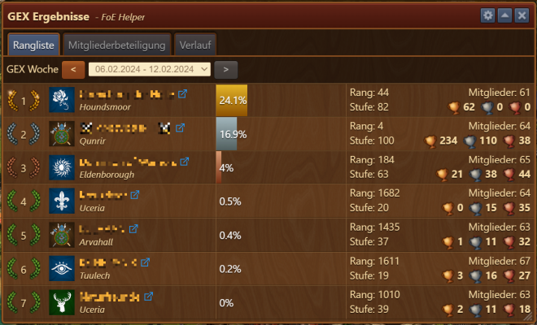
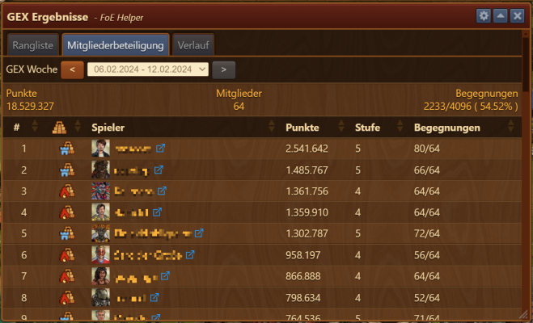
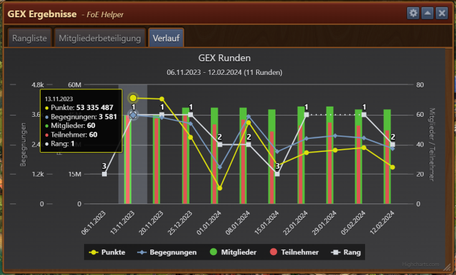
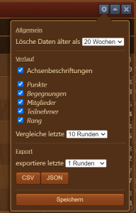

# Gildenexpedition
Dieses Modul zeigt die erreichten Leistungen der eigenen Gilde und deren Gegner während der aktuellen und der zurückliegenden Runden der Gildenexpedition. Für die eigene Gilde wird auch der individuelle Beitrag aller Gildenmitglieder angezeigt. Darüber hinaus können die Daten auf den eigenen Rechner heruntergeladen werden. 

Das Modul wird über das nachfolgend abgebildete Icon gestartet:

 

## Überblick

 

+ Die Auswahl der anzuzeigenden Daten erfolgt über das Anklicken eines der Reiter
  +  **Rangliste**
  +  **Mitgliederbeteiligung** oder
  +  **Verlauf**.
+ Die Anzeige der Daten für Rangliste und Mitgliederbeteiligung erfolgt für jeweils eine GEX-Runde. 
  Der gewünschte Zeitraum kann im Auswahlfeld der Zeile **GEX Woche** eingestellt werden (Pull-down-Menü oder Buttons).
  Voreingestellt ist die laufende GEX-Runde. Wenn für diesen Zeitraum noch keine Daten an das Modul übermittelt wurden, erscheint der Hinweis, dass zunächst die GEX im Spiel besucht werden muss.
+ Der Verlauf zeigt eine grafische Darstellung über die Ergebnisse der zurückliegenden GEX-Runden.

**Wichtig:** Es können nur die Daten dargestellt werden, die der FoE-Helfer auch erfasst hat. Dazu ist es notwendig, dass nach Abschluss einer GEX-Runde (aber vor Beginn der nächsten Runde) im Spiel einmal die Karte der GEX geöffnet wird, um die korrekten Endwerte zu bekommen.

## Rangliste

 

In der Rangliste wird die Platzierung der an der GEX-Runde beteilgten Gilden mit Gildenwappen, Gildennamen und Spielwelt sowie dem Link auf die Gilde in der Datenbank https://foe.scoredb.io angezeigt. Es folgt der erreichte Prozentsatz (64 Begegnungen je Spieler entspricht 100%) sowie weitere Informationen zu den Gilden, einschließlich der bisher erreichten Platzierungen.

## Mitgliederbeteiligung

 

Hier fehlt noch Text

## Verlauf

 

In einer grafischen Übersicht wird hier die Leistung der Gilde in der aktuellen und in zurückliegenden GEX-Runden dargestellt. Berücksichtigt werden dabei:
+ Erreichte Gesamtpunktzahl
+ Gesamtanzahl der absolvierten Begegnungen
+ Anzahl der Mitglieder in der Gilde
+ Anzahl der Gildenmitglieder, die an der jeweiligen GEX-Runde teilgenommen haben
+ Platzierung der Gilde in der jeweiligen GEX-Runde

Diese Angaben werden für die jeweilige GEX-Runde auch in tabellarischer Form mit den genauen Zahlenwerten angezeigt, wenn man den Mauszeiger innerhalb der Grafik auf die gewünschte GEX-Runde bewegt.

Wird der Mauszeiger auf einen der Datennamen in der Legende am unteren Rand des Fensters bewegt, werden diese Daten in der Grafik hervorgehoben, während die restlichen Daten nur noch schwach dargestellt werden.

Durch Anklicken eines oder mehrerer der Datennamen werden die entsprechenden Daten ausgeblendet. Erneutes Anklicken blendet die jeweiligen Daten wieder ein.

Die maximale Anzahl der dargestellten GEX-Runden sowie die Auswahl der in die Grafik aufzunehmenden Daten können an die eigenen Bedürfnisse angepasst werden. Dies wird im nächsten Abschnitt **Einstellungen und Datenexport** erläutert.

## Einstellungen und Datenexport

 

Über das Zahnrad in der Titelleiste wird das Menü für die Einstellungen aufgerufen. 

Im oberen Bereich des Menüfensters kann ausgewählt werden, für wieviele Wochen rückwirkend die erfassten Daten bereitgehalten und angezeigt werden sollen.

Im mittleren Bereich kann durch Setzen bzw. Entfernen der Häkchen ausgewählt werden, welche Angaben in der Grafik bei **Verlauf** zur Verfügung stehen sollen und wieviele GEX-Runden dort angezeigt werden sollen.

Im unteren Bereich kann ausgewählt werden, für wieviele GEX-Runden die Daten exportiert werden sollen. Durch Klick auf den **CSV** oder **JSON** Button wird das Datenformat ausgewählt und der Export gestartet.

Änderungen an den Einstellungen werden erst durch Klick auf den Button **Speichern** übernommen.
