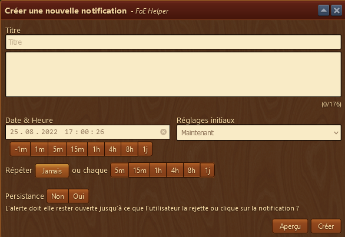
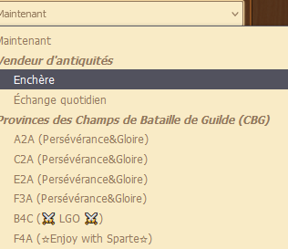

#  Alarme

Le module Alarme vous permet de créer et gérer des alarmes pour attirer ensuite votre attention.

## Structure

L'aperçu des alarmes est structurés comme suit de haut en bas :

* La zone d'affichage des alarmes
* Bouton pour créer une alarme
* Bouton pour créer une alarme pour tous les secteur en CBG

### Zone d'affichage

Est affiché l'heure d'ouverture du secteur, la fin de l'enchère ou l'heure de l'alarme que vous avez défini.

#### Menu édition d'alarme

Vous pouvez éditer votre alarme au moyen du crayon, voir un aperçu de l'alarme au moyen du bouton "Aperçu" et simplement l'effacer via le bouton Poubelle.

### Bouton créer une alarme

L'ouverture de la fenêtre vous permet de créer une alarme en mode libre avec votre titre, une description pour aider, puis dans combien de temps elle doit fonctionner.

Dans le menu "réglages initiaux" est une liste déroulante qui permet d'établir une alarme automatiquement pour l'antiquaire, un secteur en CBG

En choississant un secteur ou le vendeur d'antiquité, les titres et le champ date & heure se remplira automatiquement.

le bouton "aperçu" affiche un aperçu de votre alarme.

### Bouton Créer une alarme pour tous les secteurs

Etablis automatiquement une alarme pour tous les secteurs possibles