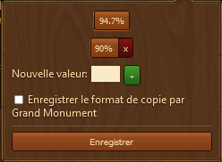
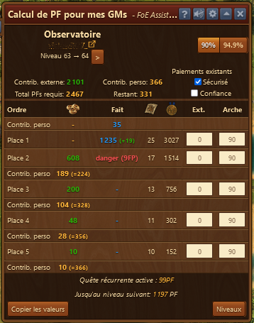

# Calculatrice GM Interne

 

Cet outil vous aidera à monter votre Grand Monument avec un fil 1.9 (ou toute autre valeur). Il calcule ce que vous devez investir de votre propre contribution pour sécuriser le parrainage, peut copier les valeurs à payer dans le presse-papiers afin qu'elles puissent ensuite être ajoutées à un chat / service de message et vérifie si les parrains ont payé correctement.

## Structure

La calculatrice GM interne est structurée comme suit de haut en bas :

* Nom du Grand Monument
* Propriétaire inclus un lien vers https://foe.scoredb.io/page du joueur
* Niveau actuel et niveau suivant du Grand Monument. Avec les flèches à côté on peut changer les niveaux afin de calculer les valeurs des niveaux suivants.
* Boutons pour changer le niveau de promotion
* **Contrib. externe :** Combien de PF les mécènes déposent au total
* **Contrib. perso :** Combien de PF vous devez payer au total
* **Total PFs requis :** La somme du mécènat et de votre propre contribution
* **Restant :** La somme que le propriétaire doite encore payer
   * **Sécurisé** - Avec cette coche, on ne tient pas compte des paiements déjà fait pour sécuriser les places (voir FAQ)
   * **Confiance** - Avec cette coche, on part du principe que ceux qui ont payé un montant ne feront pas de sur-enchère (voir FAQ)
* Tableau :
 * **Ordre** - Affiche dans quel ordre ce qui doit être payé.  Dans l'exmple, le propriétaire doit commencer par payer 7579 PF pour sécuriser la P1 et la P2.
 * Le nombre de PF qui doivent être payée
 * **Fait** - Combien de PF ont déjà été posé
 * Le nombre de plans reçus par le mécène en fonction du bonus arche
 * Le nombre de médailles reçues par le mécène en fonction du bonus arche
 * **Ext.** - Permet de simuler un payment externe et de voir son influence sur les places ([voir FAQ](#securisé))
 * **Arche** - Bonus arche (%) de chaque place. Celui-ci peut être changé individuellement
 * **Quête récurrente active :** Indique si une quête récurrente a été terminée
 * **Jusqu'au niveau suivant :** Le nombre de PF nécessaire pour finir le Grand Monument
 * **Niveaux** - Ouvre la fenêtre des niveaux qui est expliqué ci-après.
 
 ## Configuration
 
 
 
 Dans ce menu, on peut configurer les boutons  qui sont affichés dans la partie principale de la fenêtre.
 * **Enregister le format de copie par Grand Monument** - Cette option permet d'individualiser par Grand monument la copie des places.
 
 ## Fonction de copie
 
 ### Niveau facile
 
 
 
 Si vous cliquez sur la touche fléchée à gauche de la barre de titre, une boîte de dialogue s'ouvre pour écrire les emplacements individuels du niveau actuel. Celui-ci est structuré de la manière suivante : 
 
 * **Joueur** - Nom du joueur. Celui-ci peut-être modifié si vous voulez raccourcir votre nom.
 * **Bâtiment** - Nom du Grand Monument. Celui-ci peut-être aussi modifié pour le raccourcir.
 * **Données incluses** - vous spécifiez ici quelles informations doivent être fournies dans la ligne à copier : 
   * **Joueur** - Nom du joueur
   * **Grand Monument** - Nom du Grand Monument
   * **Niveau** - Niveau actuel et futur
   * **Points forge** - Le nombre de PF que chaque mécène doit payer.
   * **Descendant** - Si les places doivent être donnée dans l'ordre descendant (P5 -> P1) ou dans l'autre sens.
   * **Faire passer** - Inscrit " faire passer" pour indiquer de finir le niveau.
   * **Contribution personnelle** - Le nombre de PF que le propriétaire doit lui-même poser.
 * **Places** - indique quelles places de mécénat doivent être annoncées :
   * **Place 1** à **Place 5** - Vous pouvez cocher cette case si certains postes de mécénat doivent être explicitement annoncés, indépendamment des calculs automatiques suivants. 
   * **Tous** - Place la coche à côté des **Place 1** à **Place 5**.
   * **Auto.** - N'annonce que les places qui sont sécurisées.
   * **Auto + non vérouillé** - Annonce toutes les places y compris celles qui ne sont pas sécurisées.
   * **Aperçu** - Affiche un aperçu du texte qui sera généré
  * **Copier les valeurs** - Copie le texte généré dans le presse-papier afin qu'il puisse être copié ensuite dans un chat / service de message.
  * **Ne pas oublier** - Permet d'assembler le texte généré de plusieurs GM dans le presse-papier et de les copier en une fois dans le chat / système de message.
  
  ### Niveaux
  
  
  
  En cliquant sur **Niveaux** dans la fenêtre principale, cette fenêtre s'ouvre, où les PF requis pour le niveau suivant peuvent être affichés et copiés.
  
 * Nom du Grand Monument
 * **Niveau Max** - Niveau maximal qui doit être affiché dans la liste
 * **Total à poser** - Nombre de PF à poser par le propriétaire pour atteindre le **Niveau Max**
 * Le tableau se compose des colonnes suivantes :
   * **Niveau** - Niveau de à
   * **Place 1** à **Place 5** - Les PF qui doivent être payés par les mécènes. Les pourcentages que vous avez entrés dans la boîte de dialogue principale comptent. 
   * **Contrib. perso.** - La part personnelle qu'on doit payer. (cette colonne n'est visible que pour les GM à PF)
   * **Double récolte** - Le nombre de PF qu'on va recevoir à la fin du niveau du GM.(cette colonne n'est visible que pour les GM à PF)
   * **À poser** - **Contrib. perso.** moins **Double récolte**.
   * **Copier les valeurs** - Comme pour [niveau facile](#niveau_facile) les textes générés de la ligne en cours sont placés dans le presse-papiers afin qu'ils puissent être collés dans un chat / système de message. La configuration (coche) du niveau facile est prise en compte. 
   
 ## Paiement
 
 Dès que vous commencez à déposer vos propres points Forge dans votre GM, c'est reconnu par la calculatrice GM interne. Si vous avez payé les premiers PF, ils apparaissent sous ** Fait **, ici dans l'exemple "1831". Vous faites cela jusqu'à ce qu'un 0 apparaisse dans la première ligne ** Contrib. perso ** sous la colonne PF.
 A ce moment, la Place 1 et 2 sont sécurisées et peuvent être occupées.
Dès lors, la place 1 et la place 2 sont sûres et peuvent être occupées. 

Lorsque la première  propre contribution, la 1ère place et la 2ème place ont été payées, vous payez la prochaine contribution propre. Dans cet exemple 175 FP. Toujours en séquence de haut en bas. Voici comment votre GM reste sécurisé et ne peut pas être pillé de l'extérieur. 

** Attention ! ** Si un mécène a trop payé ou que c'est un GM dans la zone « auto-rush », entre les niveaux 30 et 60, où aucune contribution personnelle n'est nécessaire pour sécuriser les premières places, les places peuvent être à risque. Un étranger pourrait sniper cette place. C'est-à-dire déposer moins que la part requise et être toujours indépassable. Dans ce cas, un texte d'avertissement rouge « danger (xxFP) » apparaît. La valeur entre parenthèses montre combien un étranger tirerait profit d'un "snipping", dans l'exemple suivant 9 FP. Dans ce cas, vous devriez payer vous-même dans ces PF 

## FAQ

securisé
