# Gestion des Paramètres 

Ce module permet de gérer les paramètres généraux de l'application

## Structure

Le module est partagé en 4 onglets qui gérent différents aspects du module

* A propos - Information générale sur le module
* Envois - Opt-in pour l'envoi des données pour le planificateur de ville
* Fenêtres - Permet d'activer ou désactiver certaines fenêtres
* Inteface - Gère l'aspect du module

## Onglet A Propos

### A Propos 

Divers informations sur l'assistant.

#### Traduction

vous pouvez participer à la traduction via le site [weblate](http://i18n.foe-helper.com/)

### Version

vous y trouverez des informations imporantes sur :

#### Version du module
#### Votre ID de joueur FoE
#### Votre ID de guilde
#### Votre ID du monde sur lequel vous êtes avec ce module

### Aide

Vous affiche les différentes aides disponible pour l'emploi de ce module

* Site web [Foe-Helper.com](https://foe-helper.com/)
* Forum du site web [forum](https://discuss.foe-helper.com/)
* Discord [Chanel](https://discord.com/invite/z97KZq4)
* Github [Github](https://github.com/mainIine/foe-helfer-extension/issues)

## Onglet Envois

Opt-in pour l'envoi des données pour le [planificateur de ville](../.././site_web/planificateur_cite/README.md) sur le [site web](https://foe-helper.com/citymap/overview)

## Onglet Fenêtres

Dans cet onglet, vous allez pouvoir gérer le comportement de certaines fenêtres

### Négociations

Active / désactive l'ouverture de l'[assistant négociation](../negociation/README.md) lors d'une négociation. Ne fonctionne pas en Champ de bataille.  L'aide n'est pas admise par InnoGames sur le Champ de bataille.

### Investissement PF

Active / désactive l'ouverture du résumé des investissments PF lors de la visite de l'hôtel de ville -> Grands Monuments

### Export de la trésorie de guilde

Active / désactive l'assistant permettant d'exporter les modifications de la trésorie de guilde

Quand cet assistant est actif, une fenêtre s'ouvre vous permettant d'exporter le journal des contributions de ressources.

 
via la page principale de votre guilde.

#### Fonctionnement de l'assistant Export

l'assistant a un menu Configuration qui est une redondance de la fonction activation / désactivation de ce menu.

vous devez parcourir toutes les pages du journal pour lire les informations. Sauter à la dernière, ne suffit pas. 


Attention à ne pas revenir en arrière dans la lecture des pages, sinon les informations seront à double dans le résultat final.


Si vous vous trompez, vous pouvez effacer les données enregistrées au moyen du bouton "Réinitialiser" et recommencer à zéro la lecture.
L'export en CSV se fait via le bouton "Export".

### Filtre du marché

Active / désactive l'ouverture du [filtre du marché](../marche/README.md) 

### Calculatrice GM

Si cette option est activée, vous pouvez utiliser la [calculatrice GM interne](../calculatrice_gm_interne/README.md) aussi pour les GM des autres joueurs.

### Calculatrice pour le prix d'événement

Active / désactive l'ouverture de la fenêtre pour le meilleur rendement lors des évènements pour le prix du jour

### Aide au combat

Lors des combats automatiques, une fenêtre vient vous avertir qu'il ne reste que des voyous après la 1ère vague

### Galaxie bleue

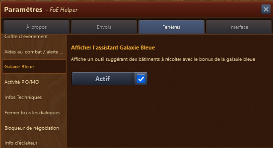

Active / désactive l'ouverture de l'[aide Galaxie bleue](../galaxie-bleue/README.md) lors de la récolte de la galaxie bleue

### Activité PO / MO

Active / désactive l'enregistrement des [événements PO / MO](../motivation/README.md).


Si la coche n'est pas mise, alors l'îcone de l'assistant PO / MO  dans le menu disparaît même si l'[îcone est active](#icone_active) dans le menu de l'assistant


### Info Technique

Active / désactive l'affichage des [Infos techniques](../info_technique/README.md) au chargement du jeu

### Fermer toutes les fenêtres

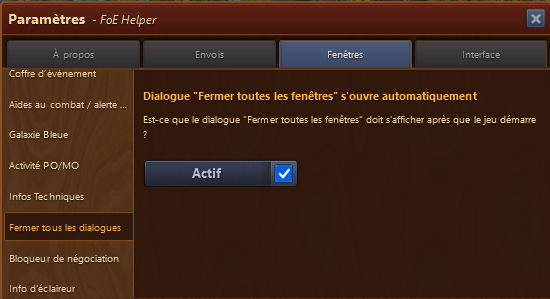

Quand cette option est choisie, une fenêtre 

s'affiche sur votre écran

#### Fonctionnement du dialogue Fermer toutes les fenêtres

En mettant la souris sur la fenêtre, s'affiche la partie basse de l'image avec une option de configuration.

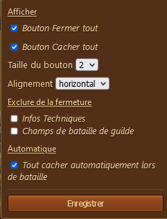

Description de la configuration :

	* Bouton Fermer tout (Croix X sur fond rouge) -> ferme toutes les fenêtres
	* Bouton Cacher tout (Oeil sur fond vert) -> cache la barre de menu 
	* Changer la taille des boutons
	* Changer l'alignement des boutons (horizontal ou vertical)
	* Exclure de la fermeture (permet de garder ces fenêtres ouvertes malgrès Fermet tout)
	* Fermeture automatique en cas de bataille

La fenêtre peut être déplacée en cliquant/tenant sur zone marquée "titre"

### Bloqueur de négociation

Active / désactive le bloqueur de négociation sur la carte de campagne 
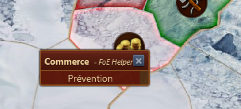

### Info de l'éclaireur

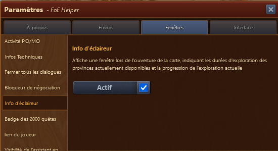

Affiche automatiquement la fenêtre d'[info de l'éclaireur](../eclaireur/README.md)  

### Badge des 2000 quêtes

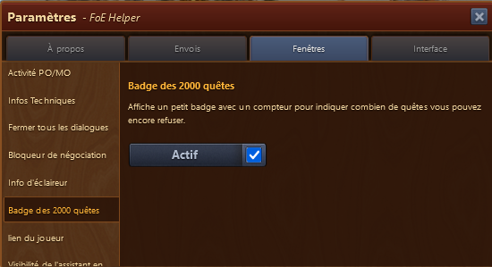

Active / désactive l'affichage du badge qui affiche le nombre de quêtes réccurentes effectuées 

### Lien des joueurs

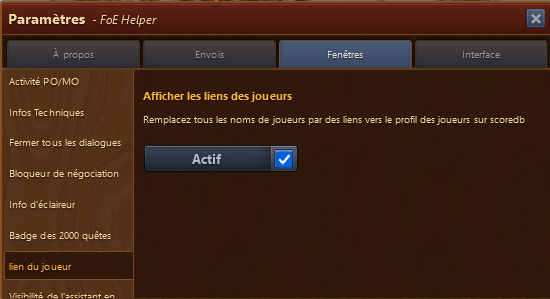

Permet d'afficher un lien  vers le site web [foe.scoredb.io](https://foe.scoredb.io)/monde/guilde/nom du joueur a chaque fois qu'un nom de joueur est affiché dans tous les modules.

### Cacher l'assistant pendant les batailles

Active / désactive l'affichage pendant les batailles. Ne fonctionne que si l'assistant est sous [forme de boite](#boite)

### Assistant Aztèque

Active / désactive l'affichage de l'assistant lors du début d'un [mini-jeu Aztèque](../azteque/README.md)

## Interface

Cet onglet permet de gérer l'aspect visuel du module

### Langue

Une fois votre langue d'interface choisie, le jeu est rechargé automatiquement

### Position du menu

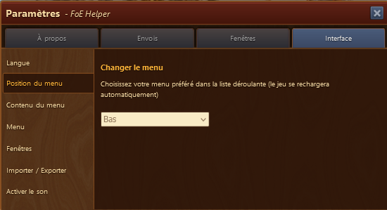

permet d'afficher le menu FOE-Assistant à différents endroits

* Bas de l'écran
* Droite de l'écran
* En fenêtre

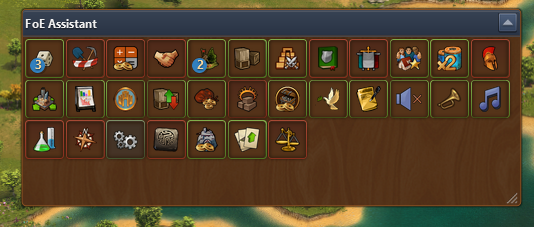

Une fois votre position de menu choisie, le jeu est rechargé automatiquement


En fonction de votre résolution / taille d'écran (fenêtre de jeu), le menu se mettra en mode Fenêtre automatiquement

	
### Contenu du menu

Permet de gérer quelles îcones sont affichés dans la barre de menu

Pour désactiver l'affichage, il suffit de faire un clic sur l'icone voulue (entourée d'un liseré vert). Elle s'enlève automatiquement et directement du menu.

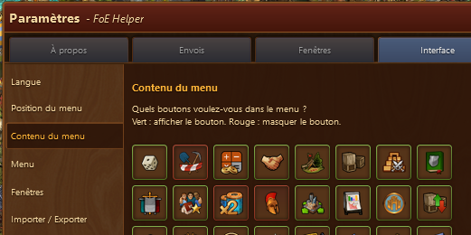 
Les îcones désactivées sont affichées avec un bord rouge dans l'interface de gestion du menu.
Les îcones avec un liséré vert sont actives.

### Largeur / longeur du Menu

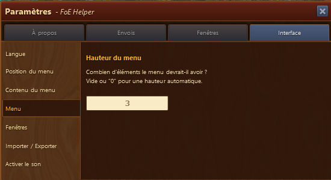

Par exemple avec le chiffre 3, comme dans l'image ci-dessus, le menu s'affiche ainsi 


En fonction de votre résolution / taille d'écran (fenêtre de jeu) ou **zoom**, le menu peut afficher un autre nombre d'îcone.


### Position des fenêtres

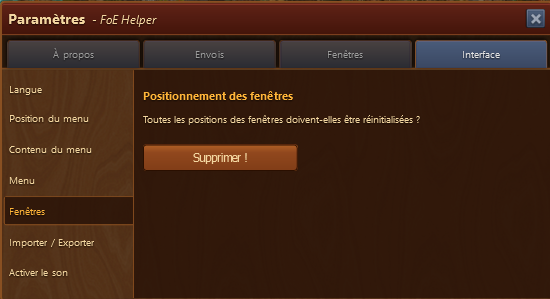

L'assistant enregistre automatiquement la position de vos fenêtres et les rouvres au même endroit. Si votre résolution, taille d'écran change entre-temps, il se peut que la fenêtre s'ouvre en dehors de la zone visible.

Le bouton "Supprimer" va réafficher par défaut toutes les fenêtres sur le centre de l'écran.

### Importer / exporter les données

Cet onglet vous permet d'exporter vos paramètres de jeu et toutes les données de votre PC sur un autre PC ou dans un autre navigateur.

#### Utilisation

le bouton "ouvrir l'outil d'import / export" ouvre cette fenêtre

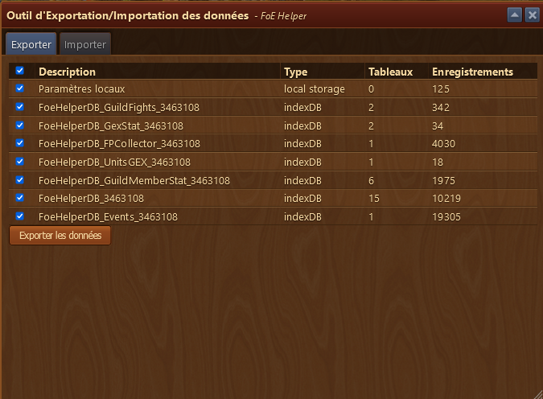

L'onglet Exporter permet d'exporter les données sous la forme d'un fichier Zip qui se trouvera pas défaut sur votre PC dans "Téléchargement"

L'onglet Importer vous permet d'importer un fichier Zip afin de charger sur votre PC. 

### Activer les sons

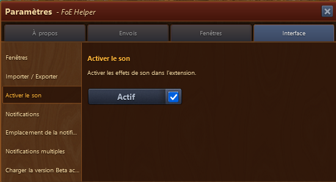

Active les sons dans tous les modules. A noter, que sur certains modules, le son pourra être désactivé via le menu du module 

### Notifications

Active / désactive toutes les notifications de l'assistant

### Emplacement des notifications

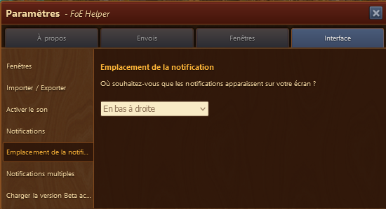

Vous pouvez choisir à quel endroit de la fenêtre apparaissent les notifications du jeu
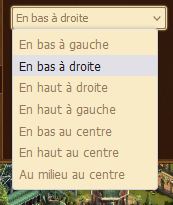

### Notifications multiples

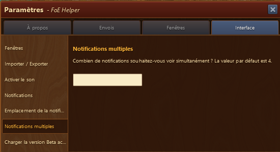

avec 3 :

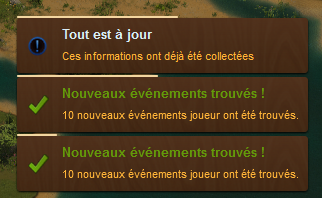

### Charger la version Beta

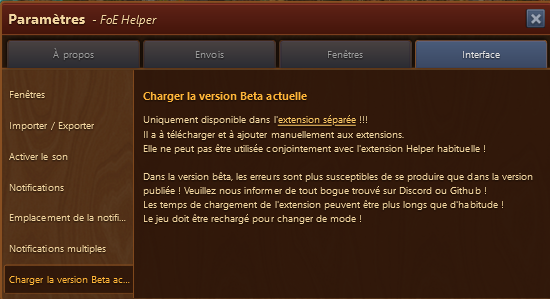

Vous permet de charger la version Beta de l'assistant en cliquant sur le lien jaune surligné. Le chargement démarre automatiquement.


La version Beta ne doit pas être employée sur le même navigateur que la version Beta


